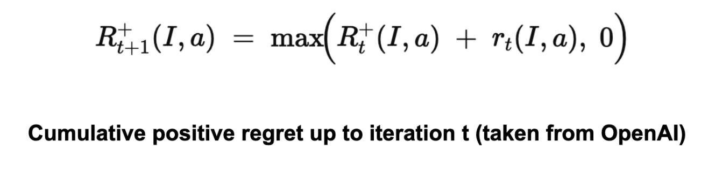
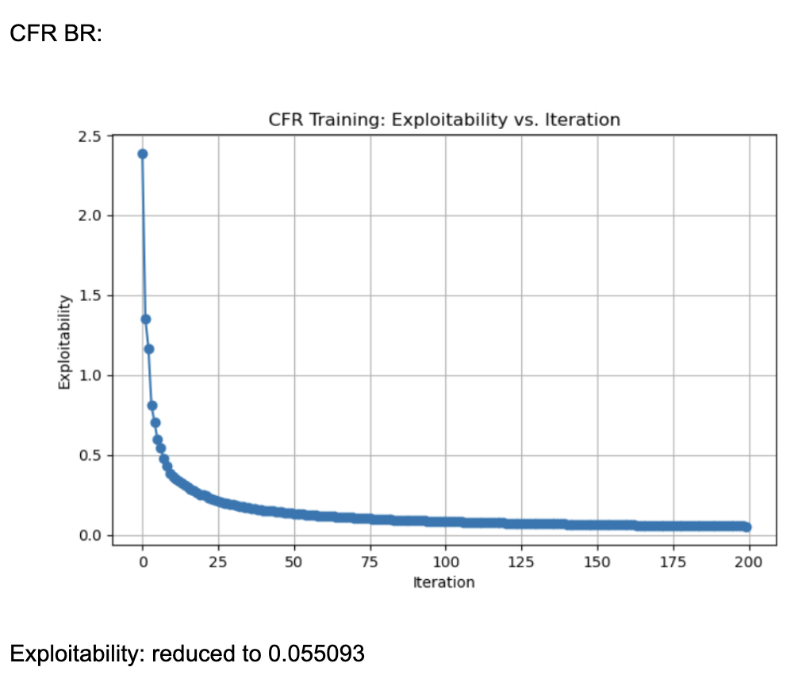

## Video Summary
[](https://youtu.be/aU9w3WtiqhE)


## Project Summary

Our initial proposal for the project was to make an agent that can play blackjack by using a DQN algorithm. However, we decided to change to making an agent that can play poker instead. Since poker is a bigger game, there are more variables to take into consideration such as betting amounts, multi-agent, and imperfect observations. All of these variables drastically change how to approach making an agent for poker games like Texas hold’em. 

Our group wanted to see if there was an optimal algorithm for solving imperfect information games. We wanted to use a variety of algorithms to train agents that would be reasonably good at playing Texas Hold’em, a popular variant of poker, and see which agents perform the best. The hope is that this would aid future approaches to solving Texas Hold’em and imperfect information games in general by showcasing the optimal algorithms we have. 

Even though the betting sizes are fixed in Limit Hold’em, there are still multiple betting rounds with multiple possible bet/raise/fold actions. Each betting sequence can branch in many ways, resulting in a huge decision tree of states, even with smaller abstractions (the “game tree”). Additionally, poker is not fully observable—each player’s hole cards remain hidden. You don’t know exactly what cards the opponent holds, so you must form a strategy that accounts for all possible opposing hands. In Limit Hold’em, a “simple” or predictable strategy can be exploited by a skilled opponent, even with fixed-limit bet sizes. Constructing a near-equilibrium strategy for all possible card distributions, betting actions, and sequences is a difficult undertaking; small rule-based systems often get punished. For these reasons, Limit Texas Hold’em, even a small abstraction of it, is a non-trivial game that would require well-trained AI/ML algorithms to solve.

Our initial goal was to be able to make an agent that can play poker against a random agent 50% of the time. Our moonshot goal was to make an agent that can win almost all the time (90-100%). In order to make an agent that can play poker we decided on a variety of algorithms during our research such as CFR (Counterfactual Regret Minimization), PPO (Proximal Policy Optimization) and NFSP (Neural Fictitious Self-Play). These are some algorithms that can handle some form of multi-agent and partially observable games. Our metrics for analyzing the performance of the agents (algorithms) are using win rate, exploitability, and total chip winnings (rewards) against a random agent to see how well it will perform.

Finding solutions for incomplete information games presents nontrivial challenges, arising from the need to determine an optimal strategy while considering the vast array of potential strategies an opponent might use. “Imperfect information games describe many practical applications found in the real world as the information space is rarely fully available,” (Tidor-Vlad Pricope). This is important to take into consideration as many real world problems often do not have practical environments to train. This includes state and actions where not everything is predictable making exploring algorithms that are incomplete worthwhile to investigate.


## Approach
One of the aforementioned approaches we are taking to tackle the project is by using the PPO (Proximal Policy Optimization) algorithm created and developed by OpenAI. A variation of the actor-critic model, which helps the agent make better decisions based on the critic neural-network which influences the actor (which decisions to make) or vice versa. The PPO algorithm also aims to reduce the surrogate loss function found in the policy in order to maxmize the rewards from the user. PPO has a lost function that looks like this:

$$
L(s,a, \theta_k, \theta) = \min \left( \frac{\pi_{\theta}(a|s)}{\pi_{\theta_k}(a|s)} A^{\pi_{\theta_k}}(s,a), \ g(\epsilon, A^{\pi_{\theta_k}}(s,a)) \right),
$$

where  

$$
g(\epsilon, A) =
\begin{cases} 
(1+\epsilon)A & A \geq 0 \\
(1-\epsilon)A & A < 0.
\end{cases}
$$

Basically finding the ratio of the policies multiplied by their advantage to see how it performs. Then, the algorithm compares it with the lower bound / upper bound changes the algorithm can perform. This makes it so the PPO algorithm cannot have a loss that is bigger / less than the desired amount (usually a small amount). This makes updating the policy incrementally small potentially taking longer to converge and or find a solution. However, it makes the algorithm much more stable in the long run.

This algorithm works well in Poker Reinforcement Learning because of its slow updating policies making it a stable algorithm. But also, it is capable of learning in partially observable environments.

The PPO algorithm was paired with the open-spiel environment that our TA recommended us for playing card games. The open-spiel environment also developed in part with google deepmind, contains universal poker which is a poker-like environment with adjustable parameters to reflect different variations of poker. For the PPO algorithm, we set the configurations as follows (similar to Texas Hold'em):

- Each player starts with 2000 chips
- 5 players total (1 as the designated agent to learn on PPO, 4 as complete random action agents)
- Each player inital bets are 50 chips
- 52 total cards in the deck (all 4 suits, 13 cards in each suit)
- 3 flipped cards in the beginning, 1 more each after. Maxes at 5. (as players continue to bet)
- Maxmium number total betting rounds cap at 4.

To learn more about how to play poker: https://bicyclecards.com/how-to-play/texas-holdem-poker.

The algorithm itself ran with these parameters:

- 1500000 timesteps
- 1600 max timesteps per episode
- 4800 timesteps per batch
- entropy coeffecient at 0.05
- clipping at 0.2
- gamma at 0.99
- learning rate at 0.001

Some of these parameters were created by the person who made the base PPO algorithm (which was modified later). The 4800 max timesteps per batch, 1600 max timesteps per episode were from the original code. Clipping, gamma, learning rate, entropy were all changed afterwards by playing around with the results of the algorithm.

Another algorithm that we explored was CFR (Counterfactual Regret Minimization). Based on our study of various research papers, the three main variants of CFR that are applied to poker are 1. CFR-BR (CFR Best Response) 2. Vanilla CFR 3. CFR+. All of these are iterative algorithms for approximating a Nash equilibrium in multi-player zero-sum games. On each iteration, the algorithm traverses the entire game tree. It computes, for each information set (the decision point for a player when they only know what cards they hold and the betting history), a set of counterfactual values that measure how good each action would have been if we had reached that state more often. CFR calculates regret for not having played each action in each state. If an action would have led to a better outcome than the action actually taken in the current strategy, the regret for not taking that action goes up. If it wouldn’t have helped, the regret does not increase. After computing regrets, CFR updates each decision’s policy (the probability distribution over actions) in proportion to the positive regrets. Actions that have accumulated more regret in the past have a higher probability of being chosen in future iterations. Although CFR updates a current policy each iteration, the final (or running average) strategy across all iterations converges to a Nash equilibrium (in two-player zero-sum games).


CFR-BR (CFR + Best Response) typically replaces only one player’s CFR update with a best-response calculation (an exploitative strategy) to either measure exploitability. So, only one side does CFR updates while the other tries to exploit the current strategy. Meanwhile, CFR+ is an enhanced version of CFR that modifies how regrets are accumulated—specifically by “clipping” them to never fall below zero—and often uses an alternating update scheme between players, enabling much faster convergence in practice compared to standard CFR.

During execution, the solver runs through half the specified iterations, evaluating and printing the exploitability after each one to track how close the strategy is to optimal. The trained solver is then saved to a pickle file, loaded back, and its exploitability is verified to ensure proper persistence. The code then continues training for the remaining iterations using the loaded solver, printing both the tabular policy length and ongoing exploitability measurements. Every 20 iterations, the algorithm plays against a random agent and updates its policy accordingly. There are 200 iterations total. Each call to evaluate_and_update_policy() performs one iteration of the CFR algorithm. exploitability(game, solver.average_policy()) measures how close (in terms of expected payoff) the current average policy is to a true Nash equilibrium. The lower the exploitability, the better.


The algorithm is detailed mathematically as follows:


For each action a∈A(I), it defines the (instantaneous) counterfactual regret at iteration t by looking at all histories h belonging to information set I, weighting each history by the probability that the other players’ actions led to h, and comparing the utility if you force action a in I versus the utility under the current strategy.


It accumulates this regret across iterations, and resets to 0 if it ever becomes negative.





Finally, it uses these positive regrets to define the policy at iteration t+1. For each information set I and action a∈A(I)a.


Thus, the probability of choosing action a is proportional to the accumulated positive regret for a.


Another algorithm we explored was Neural Fictitious Self-Play, using DQN as the inner-RL algorithm. As Johannes Heinrich and David Silver describes it in their paper "Deep Reinforcement Learning from Self-Play in Imperfect-Information Games", "NFSP combines FSP with neural network function approximation...  all players of the game are controlled by separate NFSP agents that learn from simultaneous play against each other, i.e. self-play. An NFSP agent interacts with its fellow agents and memorizes its experience of game transitions and its own best response behaviour in two memories," and "treats these memories as two distinct datasets suitable for deep reinforcement learning and supervised classification respectively." (Heinrich and Silver) The agent trains a neural network to predict action values using DQN, resulting in a network that represents the agent's average strategy, which selects a random action with probability and otherwise chooses the action that maximizes the predicted action values. 

After testing and tuning different hyperparameters, our NFSP agents were configured to have the following: 
```
        agent_configs = {
                "hidden_layers_sizes": [256, 256],        
                "reservoir_buffer_capacity": int(1e6),    
                "anticipatory_param": 0.1,
                "batch_size": 256,
                "rl_learning_rate": 0.01,
                "sl_learning_rate": 0.01,
                "min_buffer_size_to_learn": 10000,
                "learn_every": 64,
                "optimizer_str": "adam",                  # Adam optimizer
                
                "replay_buffer_capacity": int(1e6),      
                "epsilon_start": 1.0,
                "epsilon_end": 0.01,
            }
```
and these were all passed to the python implementation of the NFSP algorithm that OpenSpiel has available. Loss is minimized by Adaptive Moment Estimation (ADAM) on the neural networks that are trying to approximate best responses and average strategies. ADAM is two stochastic gradient descent approaches, Adaptive Gradients and Root Mean Square Propagation combined to calculate a stochastic approximation using randomly selected data subset as opposed to the entire data set (https://blog.marketmuse.com/glossary/adaptive-moment-estimation-adam-definition/). 
 

## Evaluation
As mentioned in the project summary, metrics that were used to measure the performance of each agent were win rates (against random agents / against each other), exploitability, and chip winnings.

As for the PPO algorithm, the agent was trained against a random agent (an agent that does random actions). 


Here, the PPO algorithm in 1 million timesteps seems to have difficulty at gaining more rewards as more episodes/timesteps go by. This is due to the nature of the PPO algorithm having a difficult time converging to an optimal policy since poker is a partially observable game. Partially observable makes the PPO algorithm change its prediction making it unstable in the long term. On the other hand, the PPO algorithm seemed to perform better than expected partially due to the smaller version of the poker game that we decided to test on.


The graph illustrating the average win rate in 100 games per iteration seemed to perform better than anticipated. It averages around higher than a 50% win rate. This is due to the agent likely trained against a random agent, so it is likely that the PPO agent performed better (higher than 50%).


When it came to evaluating the 3 variants of CFR algorithms, we found the following, tgraphs plotting exploitability for the three algorithms looked like the following:





These results were generated by running 200 iterations of each algorithm (CFR, CFR+, and CFR-BR) with a random agent matching these algorithms ever 20 iterations for policy updates. Each information set (player viewpoint) keeps track of regrets for each action, updated every iteration through tabular regret matching. Looking at the normal CFR algorithm, it starts with exploitability around 2.5 and declines rapidly in the first few iterations. By iteration ~25, it is already under 0.5 exploitability. It continues to drop and eventually levels out around 0.016 by iteration 200. The curve shows a characteristic fast initial drop followed by a more gradual improvement. Looking at CFR+, it also starts at around 2.5 exploitability and quickly falls to below 0.5 within the first 25 iterations. By iteration 200, exploitability is approximately 0.002, which is significantly lower than the vanilla CFR result. CFR+ is known to converge faster (and typically to a lower exploitability) in practice because of its modified regret and strategy update rules (often referred to as “regret matching+”), which tend to handle negative regrets and strategy bounding more effectively. CFR-BR shows a similar steep drop initially but levels off closer to 0.055 at iteration 200. It does not converge as quickly or as deeply as CFR+ in terms of exploitability. Some versions of “CFR-BR” alternate between re-solving with CFR and explicitly computing best responses for one or more players, which can cause bigger initial drops but may stabilize at a higher exploitability. The key reason CFR+ outperforms vanilla CFR is because of the way it modifies regret accumulation and strategy updates. Through regret matching+, it bounds negative regrets, so it doesn’t carry forward past “bad actions” in regret calculations, allowing it to focus on positive-regret actions and converge faster, leading to lower exploitability.


Additionally, we wanted to try CFR+ (the most accurate/lowest exploitability CFR algorithm) against a random agent to see how well it performs. We got the following two graphs:


For the graph, we can observe that the CFR agent's average returns generally stay above zero, indicating an overall advantage over the random agent. The highest average return is 2.640 at iteration 177, and it generally stays around the 1.5 - 1.7 average return rate mark. We can observe that the CFR agent's win rate often hovers between 40% and 50%, showing a slight edge over the random agent. Its highest win rate is 0.514 (51.4%) which is around 20% greater than the average win rate for a medium level player which hovers around 20%. The frequent ups and downs across iterations reflect the inherent variability in the strategy’s adjustments based on policy updates over time. While a 50% win rate might not seem significant, in poker, especially a variant like Texas Hold’em, winning percentage (the fraction of individual hands or pots you win) is not the same as expected value (the long-term profit in chips or money). Even an optimal poker strategy can end up winning only about half of the individual hands against a random strategy—yet still earn a positive profit over time. CFR+ (like most strong poker bots) is focused on minimizing exploitability and maximizing expected return, not on winning the largest fraction of hands. Sometimes an optimal or near-optimal play will fold in marginal spots, resulting in a “lost” hand, but saving chips in the long run.This 50% statistic seemed consistent (and actually higher by around 3%) than most other implementations of CFR+ against poker agents in external research papers.

Broadly, CFR+ excels at finding near-equilibrium strategies in Limit Texas Hold’em by systematically reducing exploitability through fast, stable updates of accumulated regrets. Its strengths include faster convergence than classical CFR and algorithms like NFSP, significantly reducing its opponent's ability to exploit its strategy, as well as reliable performance in two-player zero-sum settings. However, it can be memory-intensive and computationally demanding at large scales, and it does not trivially extend to multiplayer scenarios, adaptive opponent modeling, or games with extremely large state and action spaces like No-Limit Texas Hold'em.


To evaluate our agent trained by NFSP, we looked at its win-rate against a random bot and the average return it had every 10000 episodes. We trained for a total of 400,000 episodes. 


Our results show that because we train the agent as going first in the game, when the NFSP agents play against a random agent, the NFSP agent that goes first (Player 1) performs much better than the one that goes second (Player 0). This is reflected in both the win-rate and average return (or payoff) that the agents got as they won or lost games. This is the agent that we used for the following evaluations. 

To evaluate if our goal of making an agent that can beat a random agent more than 50% of the time, we ran 10 intervals of 1000 games of the trained models vs a random agent in our custom definition of Limit Texas Hold'em. 

  

All three algorithms were able to train a model that beats the random agent at least 50% of the games it played. These graphs show the win-rate as a function of iterations, where each iteration is 1000 games played between the two agents. PPO was able to beat the random agent just about more than half the games it played, with a win-rate hovering around the 51%-53%. NFSP was able to win at least 60% of its games every iteration, showing that it is very strong against the random agent compared to PPO. However, CFR+ has a slight edge on NFSP versus the random agent, with an average win-rate of about 65%. We believe that NFSP and CFR+ performed better against the random agent because PPO is an algorithm that attempts to exploit past rewarding strategies, but against a random agent, it will not be reliably learning a strategy that is able to beat the random agent every time. 

We also wanted to see which algorithm would perform the best when pitted against each other, as this would give insight into which algorithm would be a better choice should want to train for a larger-scale game. We observed the performance of each algorithm against each other over 10,000 games. 

  

In the first chart, both NFSP and PPO hover near the 50% win‐rate mark over the 10 iterations, with NFSP ending slightly higher on average. Quantitatively, the difference is only a few percentage points, reflecting that both methods are general‐purpose RL algorithms capable of learning reasonable strategies. Qualitatively, NFSP’s ability to maintain an approximate average strategy (via its supervised learning component) helps it adapt more consistently in a multi‐agent, partially observed environment. By contrast, PPO’s on‐policy updates can lead to more volatile performance in poker, so it lags just behind NFSP over these iterations.

In the second chart, CFR+ consistently outperforms PPO by a moderate margin, generally staying a few points above 55% while PPO is just below that mark at 45%. CFR+ is purpose‐built for two‐player zero‐sum, imperfect‐information games and minimizes exploitability via its counterfactual regret updates, giving it a clear structural advantage. PPO, despite occasionally catching up when it finds profitable policies, does not directly optimize for low exploitability and so remains somewhat behind. The short‐term fluctuations reflect the inherent variance in learning, but the overall trend shows CFR+ as a stronger algorithm in this matchup. However, this difference is not as large as we expected.After changing hyperparameters, PPO’s policy gradient approach can nearly match CFR+. In smaller/less complex settings, the specialized advantages of CFR+ over PPO don’t lead to a huge gap in performance.

In the final chart, CFR+ achieves a significantly higher win rate—usually between 60% and 70% while NFSP tends to remain below at 30-40%. This larger gap illustrates just how effectively CFR+ pinpoints near‐Nash strategies in a heads‐up poker setting. Although NFSP is expressly designed for multi‐agent learning, it is still a more general approach and must rely on neural approximations to converge. CFR+’s direct handling of counterfactual regrets and systematic averaging of strategies yields a much stronger policy in fewer iterations as opposed to NFSP's appoximations, explaining its consistently higher performance. Since each iteration specifically reduces how the strategy can be exploited, CFR+ quickly converges toward a decision policy that offers fewer weaknesses an opponent can exploit, which is why it beats NSFP approximations.

In general, we learned that for win rate specifically, as well as low exploitability, CFR algorithm is by far the the best for the largest-possible win rate due to its regret-matching/reducing exploitability strategy — this is the algorithm that is most likely to yield the best results when adapted to larger games like No-Limit Texas Hold'em. In general, NFSP / CFR algorithms are well suited for advanced poker games with bigger state and action spaces and unpredictable environments. Algorithms like PPO only work well when the environment is predictable. We also learned that different opponents (how they are trained such as who goes first in a game) can drastically change the agent in how they perform/learn over time. In the future, we would need more computationally intensive resources (such as memory), and more time to train these agents/algorithms for longer (days or weeks) in order to get better results for larger games like No-Limit Texas Hold ‘em (without any abstractions).


## Resources Used
We used OpenSpiel's universal_poker implementation as a starting point for our code, and are using its implemented algorithms as a library. We also referenced Stanford class project's paper (https://web.stanford.edu/class/aa228/reports/2018/final96.pdf) when considering our approach to our project. 

Helped with understanding a bit about the PPO algorithm (along with the lecture slides).
https://medium.com/analytics-vidhya/coding-ppo-from-scratch-with-pytorch-part-1-4-613dfc1b14c8

PPO algorithm such as all the math from Open AI (developers themselves)
https://spinningup.openai.com/en/latest/algorithms/ppo.html 

Open-Spiel Environment (Specifically universal_poker environment and the 3 variants of the CFR algorithm).
https://github.com/google-deepmind/open_spiel 

Helped with integrating open-spiel environment with gym environment to use with the PPO algorithm
https://www.gymlibrary.dev/api/wrappers/ - help with using the algorithm

Entropy in PPO algorithm:
https://medium.com/aureliantactics/ppo-hyperparameters-and-ranges-6fc2d29bccbe

Deep Reinforcement Learning from Self-Play in Imperfect-Information Games (Johannes Heinrich and David Silver)
https://arxiv.org/pdf/1603.01121

Deep Reinforcement Learning from Self-Play in No-Limit Texas Hold’em Poker (Tidor-Vlad Pricope) https://pdfs.semanticscholar.org/00dd/c9ceb1c107f8d9f9626d6bb27daf61ffadc7.pdf

ADAM Optimizer
https://blog.marketmuse.com/glossary/adaptive-moment-estimation-adam-definition/ 


## AI Tool Usage
AI (ChatGPT) was used to help make changes in the PPO algorithm (in the codebase above), 1) helping change the PPO algorithm handle continuous to discrete inputs/outputs. 2) Alter it so that it is able to add some sort of exploration within the PPO algorithm using entropy.

AI was used in the creation of a wrapper to wrap around an NFSP agent in order to procure its average policy to use in Open Spiel. These would be the classes NFSPPolicy(policy.Policy) in the evaluation code where NFSP is being used. It was also used to create a wrapper for PPO models loaded using stable-baselines, which would be the class PPOPolicy in the evaluation code where PPO is being used. 

A custom environment wrapper was needed to load the game with the correct parameters that we customized. This is the class CustomPokerEnv(rl_environment.Environment in the code.

The function evaluate_against_random_bots found in the main.py of the nfsp folder was originally written by AI, with minor changes to be used in our environment. 


