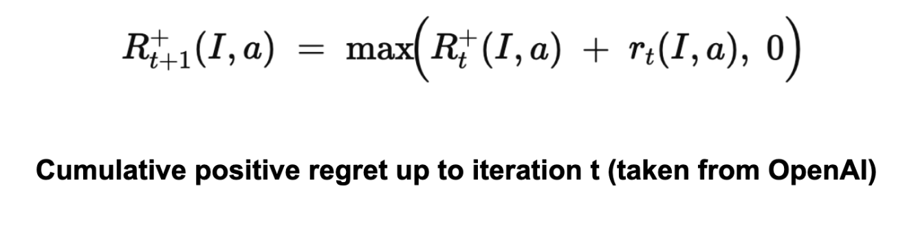

https://youtu.be/QDUY3KO2Lvg

[](https://youtu.be/QDUY3KO2Lvg)


## Summary of the Project (UPDATED)

Our inital proposal of the project was tailored to blackjack and using DQN to train. However we realized the sheer limitations of the project in a single agent game with only 2 cards. Instead we wanted to expand and play more complicated games such as poker. For this project, we would like to train an agent that can play multi-agent poker games like limited Texas hold'em. Our inital goal is to make sure we train the agents so that they are able to play poker using reinforcement learning algorithms like CFR, PPO, NSFP. We initally thought of DQN however, the agent do not know all possible states making it difficult to justify using DQN. We did some research and found that potentially CFR might be able to aid in solving poker. PPO similarly can handle games that are partially observable, making a potential candidate. We realize that there are probably better algorithms out there, but these are the two algorithms we are focusing on. For the algorithms we will take into account such as exploitability, round win-rates, and total chip winnings as part of the agent's performance.

Our ultimate goal in this first inital proposal was to get a feel for the different algorithms and make sure they overall work. By work, I mean they are able to play poker and become somewhat successful at it.


## Approach
One of the aforementioned approaches we are taking to tackle the project is by using the PPO (Proximal Policy Optimization) algorithm created and developed by OpenAI. A variation of the actor-critic model, which helps the agent make better decisions based on the critic neural-network which influences the actor (which decisions to make) or vice versa. The PPO algorithm also aims to reduce the surrogate loss function found in the policy in order to maxmize the rewards from the user. PPO has a lost function that looks like this:

$$
L(s,a, \theta_k, \theta) = \min \left( \frac{\pi_{\theta}(a|s)}{\pi_{\theta_k}(a|s)} A^{\pi_{\theta_k}}(s,a), \ g(\epsilon, A^{\pi_{\theta_k}}(s,a)) \right),
$$

where  

$$
g(\epsilon, A) =
\begin{cases} 
(1+\epsilon)A & A \geq 0 \\
(1-\epsilon)A & A < 0.
\end{cases}
$$

Basically finding the ratio of the policies multiplied by their advantage to see how it performs. Then, the algorithm compares it with the lower bound / upper bound changes the algorithm can perform. This makes it so the PPO algorithm cannot have a loss that is bigger / less than the desired amount (usually a small amount). This makes updating the policy incrementally small potentially taking longer to converge and or find a solution. However, it makes the algorithm much more stable in the long run.

This algorithm works well in Poker Reinforcement Learning because of its slow updating policies making it a stable algorithm. But also, it is capable of learning in partially observable environments.

The PPO algorithm was paired with the open-spiel environment that our TA recommended us for playing card games. The open-spiel environment also developed in part with google deepmind, contains universal poker which is a poker-like environment with adjustable parameters to reflect different variations of poker. For the PPO algorithm, we set the configurations as follows (similar to Texas Hold'em):

- Each player starts with 2000 chips
- 5 players total (1 as the designated agent to learn on PPO, 4 as complete random action agents)
- Each player inital bets are 50 chips
- 52 total cards in the deck (all 4 suits, 13 cards in each suit)
- 3 flipped cards in the beginning, 1 more each after. Maxes at 5. (as players continue to bet)
- Maxmium number total betting rounds cap at 4.

To learn more about how to play poker: https://bicyclecards.com/how-to-play/texas-holdem-poker.

The algorithm itself ran with these parameters:

- 1500000 timesteps
- 1600 max timesteps per episode
- 4800 timesteps per batch
- entropy coeffecient at 0.05
- clipping at 0.2
- gamma at 0.99
- learning rate at 0.001

Some of these parameters were created by the person who made the base PPO algorithm (which was modified later). The 4800 max timesteps per batch, 1600 max timesteps per episode were from the original code. Clipping, gamma, learning rate, entropy were all changed afterwards by playing around with the results of the algorithm.

Another algorithm we evaluated was the CFR algorithm. Our code evaluates a poker game solver using different variants of Counterfactual Regret Minimization (CFR) algorithms. It defines a custom limited hold'em poker game with specific parameters including 2 players, 1 betting round, defined blinds and raise sizes, and card distributions. The program allows users to choose between three CFR solver variants: standard CFR, CFR+ (an improved version), or CFR-BR (with best response). During execution, the solver runs through half the specified iterations, evaluating and printing the exploitability after each one to track how close the strategy is to optimal. The trained solver is then saved to a pickle file, loaded back, and its exploitability is verified to ensure proper persistence. The code then continues training for the remaining iterations using the loaded solver, printing both the tabular policy length and ongoing exploitability measurements. This implementation uses OpenSpiel framework to approximate a Nash equilibrium strategy for the defined poker game, where neither player could improve their expected value by changing their strategy.


Our game is defined in the following way:
CUSTOM_LIMIT_HOLDEM_ACPC_GAMEDEF = """\
GAMEDEF
limit
numPlayers = 2
numRounds = 1
blind = 2 4
raiseSize = 4 4 8
firstPlayer = 1
maxRaises = 2 2 2
numSuits = 2
numRanks = 5
numHoleCards = 1
numBoardCards = 0 2 1
stack = 20
END GAMEDEF
"""


This is a small, custom, 2-player “limit hold’em”-style game. It is a simplified version of the Texas Hold’em game (which uses 2 hole cards, 5 community cards in multiple rounds, etc.). numHoleCards = 1 means each player gets just 1 hole card, and numBoardCards = 0 2 1 indicates the dealing of 3 total board cards in stages. The Universal Poker engine in OpenSpiel can parse ACPC game definitions, so any game configuration we provide in ACPC format (including Texas Hold’em) can be loaded here.

Specifically, we compare a tradtional CFR algorithm with a CFR+ algorithm (an improved version that tends to converge faster), and CFR-BR algorithm. All of these are iterative algorithms for approximating a Nash equilibrium in multi-player zero-sum games. Each call to evaluate_and_update_policy() performs one iteration of the CFR algorithm.
exploitability(game, solver.average_policy()) measures how close (in terms of expected payoff) the current average policy is to a true Nash equilibrium. The lower the exploitability, the better.


Specifically, the CFR algorithm can be defined by the following equation:


For each action a∈A(I), it defines the (instantaneous) counterfactual regret at iteration t by looking at all histories h belonging to information set I, weighting each history by the probability that the other players’ actions led to h, and comparing the utility if you force action a in I versus the utility under the current strategy.

It accumulates this regret across iterations, and resets to 0 if it ever becomes negative.



Finally, it uses these positive regrets to define the policy at iteration t+1. For each information set I and action a∈A(I)a.


Thus, the probability of choosing action a is proportional to the accumulated positive regret for a.


Another algorithm we explored was Neural Fictitious Self-Play, using DQN as the inner-RL algorithm. As Johannes Heinrich and David Silver describes it in their paper "Deep Reinforcement Learning from Self-Play in Imperfect-Information Games", "NFSP combines FSP with neural network function approximation...  all players of the game are controlled by separate NFSP agents that learn from simultaneous play against each other, i.e. self-play. An NFSP agent interacts with its fellow agents and memorizes its experience of game transitions and its own best response behaviour in two memories," and "treats these memories as two distinct datasets suitable for deep reinforcement learning and supervised classification respectively." (Heinrich and Silver) The agent trains a neural network to predict action values using DQN, resulting in a network that represents the agent's approximate best response strategy, which selects a random action with probability and otherwise chooses the action that maximizes the predicted action values. 

The agents were configured to have the following parameters: 
```
        agent_configs = {
                "hidden_layers_sizes": [256, 256], 
                "reservoir_buffer_capacity": int(2e6),
                "anticipatory_param": 0.1,
                "batch_size": 256,
                "rl_learning_rate": 0.001,
                "sl_learning_rate": 0.001,
                "min_buffer_size_to_learn": 10000,
                "learn_every": 64,
                "optimizer_str": "adam",
                
                # parameters for DQN
                "replay_buffer_capacity": int(2e6),
                "epsilon_start": 0.06,
                "epsilon_end": 0.001,
        }
```
and these were all passed to the python implementation of the NFSP algorithm that OpenSpiel has available. Loss is minimized by stochastic gradient descent updates on the neural networks that are trying to approximate best responses and average strategies. 
 

## Evaluation

The results of the PPO algorithm is limited to 1500000 timesteps and the environment and the results may not reflect actual poker gameplay.
[INSERT GRAPH?]
The results of the graph that was generated from the performance of the agent using the PPO algorithm can be seen above. While the graph is hard to read, there is a clear trend in performance in average episodic return being higher as more iterations are performed while playing Texas hold em. The return seems to be steadily increasing (the reward / # of chips average gained per episode vs iteration). At around 30 iterations to 130 iterations, there seems to be some stagnation in terms of episodic reward growth. A possibility for that is due to the AI agent finding difficulty in trying to find other optimal strategies besides folding, thus leading to a -50 (which is the initial amount bet) and instantly folding. To combat this, we decided to add a way for the agent to explore a little bit to find other optimal strategies besides folding. After the stagnation in the initial episodic returns, there seems to be another gain all the way to touching 400 chips in one episode. Thus showing potential growth from the AI agent itself.

Another metric that was analyzed closely was the average actor loss. In order for the algorithm to be “stable”, we want the “surrogate loss function” to stabilize and or having a small error. This shows that the algorithm is likely to be converging which can be shown in the graph above. Stablizing at around -0.2 actor loss then exploring new strategies caused the AI agent to stabilize at a new -0.10 range of actor loss. This means that the PPO algorithm is likely to be improving over the iterations, while making small incremental changes to its policy. 

When it came to evaluating the 3 variants of CFR algorithms, we found the following:
CFR (Counterfactual Regret Minimization):
- Basic Algorithm: Iteratively computes counterfactual regrets and updates strategies via regret matching.
- No “Plus” Modifications: Standard CFR directly uses cumulative regrets (positive and negative) to form the next iteration’s policy.

CFR+:
- Regret-Matching: Applies a “positive part” operation to regrets (negative regrets are reset to 0).
- Linear Averaging: Uses linear weighting of iterates when forming the average strategy, to improve empirical convergence.
- Faster Convergence: CFR+ converges faster and more stably than vanilla CFR in games like poker.

CFR-BR:
- Iterative Best Responses: At each iteration, for each player p, it computes a best response against the current policy of the other players, then updates player p’s regrets/policy accordingly.
- Policy Overrides: policy_overrides_ used to temporarily force other players to follow their best-response policies (except for the player currently updating).
- Not the Same as “Alternating Updates”: Unlike standard CFR or CFR+ where all players update regrets each iteration (or in round-robin fashion), CFR-BR explicitly uses best response computations for the opponents.

The graphs plotting exploitability for the three algorithms looked like the following:


These results were generated by running 200 iterations of each algorithm (CFR, CFR+, and CFR-BR). They use external sampling and regrets are accumulated over iterations without discount. Each information set (player viewpoint) keeps track of regrets for each action, updated every iteration through tabular regret matching. Looking at the normal CFR algorithm, it starts with exploitability around 2.5 and declines rapidly in the first few iterations. By iteration ~25, it is already under 0.5 exploitability. It continues to drop and eventually levels out around 0.016 by iteration 200. The curve shows a characteristic fast initial drop followed by a more gradual improvement. Looking at CFR+, it also starts at around 2.5 exploitability and quickly falls to below 0.5 within the first 25 iterations. By iteration 200, exploitability is approximately 0.003, which is significantly lower than the final CFR result. CFR+ is known to converge faster (and typically to a lower exploitability) in practice because of its modified regret and strategy update rules (often referred to as “regret matching+”), which tend to handle negative regrets and strategy bounding more effectively. CFR-BR shows a similar steep drop initially but levels off closer to 0.055 at iteration 200. It does not converge as quickly or as deeply as CFR+ in terms of exploitability. Some versions of “CFR-BR” alternate between re-solving with CFR and explicitly computing best responses for one or more players, which can cause bigger initial drops but may stabilize at a higher exploitability. The key reason CFR+ outperforms vanilla CFR is because of the way it modifies regret accumulation and strategy updates. Through regret matching+, it bounds negative regrets and maintains a smoothed  update to the strategy.


To evaluate our agent trained by NFSP, we looked at its winrate against a random bot and the average return it had every 10000 episodes. 

## Remaining Goals and Challenges

Now that we know our models are at least working to some extent, we aim to finish off the quarter/project by: 

- Compare the different algorithms that were used (CFR/PPO) and see their performance using similar parameters
- Training the agents that do not use random actions
- Agent vs Agents and see how they perform against each other with different parameters
- Analyze each of the agents and see what types of frequent actions they are taking, then optimize accordingly
- Figure out which is the more optimal algorithm for poker against these algorithms

This list might not be exhaustive and all of these goals are not expected to be completed due to the sheer limitation in time we have left for this project. However, we will strive our best to achieve as much of these goals on this list as possible.

## Resources Used
We used OpenSpiel's universal_poker implementation as a starting point for our code, and are using its implemented algorithms as a library. We also referenced Stanford class project's paper (https://web.stanford.edu/class/aa228/reports/2018/final96.pdf) when considering our approach to our project. 

Helped with understanding a bit about the PPO algorithm (along with the lecture slides).
https://medium.com/analytics-vidhya/coding-ppo-from-scratch-with-pytorch-part-1-4-613dfc1b14c8

The PPO algorithm used based on the article above, but with some minor tweaks/changes.
https://github.com/ericyangyu/PPO-for-Beginners/blob/master/ppo.py  (repository - PPO for beginners)

PPO algorithm such as all the math from Open AI (developers themselves)
https://spinningup.openai.com/en/latest/algorithms/ppo.html 

Open-Spiel Environment (Specifically universal_poker environment and the 3 variants of the CFR algorithm).
https://github.com/google-deepmind/open_spiel 

Helped with integrating open-spiel environment with gym environment to use with the PPO algorithm
https://www.gymlibrary.dev/api/wrappers/ - help with using the algorithm

Entropy in PPO algorithm:
https://medium.com/aureliantactics/ppo-hyperparameters-and-ranges-6fc2d29bccbe

Deep Reinforcement Learning from Self-Play in Imperfect-Information Games (Johannes Heinrich and David Silver)
https://arxiv.org/pdf/1603.01121

AI (ChatGPT) was used to help make changes in the PPO algorithm (in the codebase above), 1) helping change the PPO algorithm handle continuous to discrete inputs/outputs. 2) Alter it so that it is able to add some sort of exploration within the PPO algorithm using entropy.
